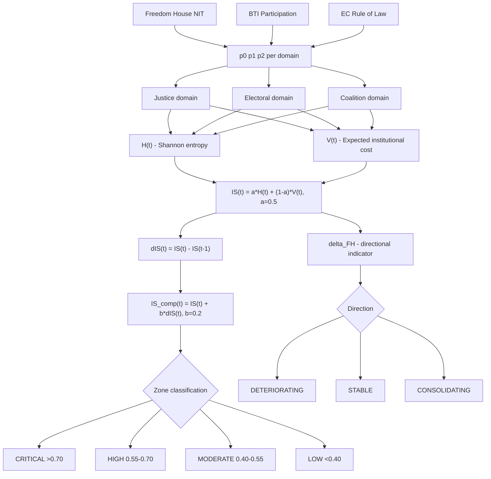

EEF — Entropic Equilibrium Function
Politomorphism Engine | Complete Methodology Documentation
Sections 3.2 · 3.3 · 3.4 · 3.5 · 3.6 · 3.7 · Validation · Appendix
Prof. Serban Gabriel Florin | ORCID: 0009-0000-2266-3356
OSF: https://doi.org/10.17605/OSF.IO/HYDNZ | GitHub: profserbangabriel-del/Politomorphism
---
Overview
The Entropic Equilibrium Function (EEF) measures political systemic instability as Shannon entropy over institutional state distributions. It produces a static score H(t) per domain, an aggregate instability score with zone classification, and a sensitivity analysis.
FIIM v2.1 (Fuzzy Institutional Instability Model) extends EEF by replacing hard threshold mapping with continuous fuzzy membership functions and combining normalized entropy with an expected institutional cost index.
---
Architecture

---
Notation
Symbol	Definition
S(t)	Raw Shannon entropy: S(t) = -sum p_i(t) * ln(p_i(t)) [nats, base e]
S_max	Maximum entropy: ln(N) = ln(3) approx 1.0986 nats
H(t)	Normalized entropy: H(t) = S(t) / S_max in [0,1]
V(t)	Expected institutional cost: V(t) = 0.0p0 + 0.5p1 + 1.0*p2
IS(t)	Static instability score: IS(t) = alpha*H(t) + (1-alpha)*V(t), alpha=0.5
Delta_IS(t)	Discrete dynamics: Delta_IS(t) = IS(t) - IS(t-1)
Pi(t)	Disorder-increasing component: Pi(t) = max(0, Delta_IS(t))
Phi(t)	Order-restoring component: Phi(t) = max(0, -Delta_IS(t))
IS_comp(t)	Composite forward-looking score: IS_comp(t) = IS(t) + beta*Delta_IS(t), beta=0.2
---
3.2 Operationalization of the EEF
For each institutional domain d in {Justice, Electoral, Coalition}, the system state at time t is modeled as a discrete random variable with 3 ordered states:
State	Label	Interpretation
S0	Favorable / Stable	Functional institutions; tensions absent or minor
S1	Intermediate / Strained	Significant dysfunctions; regulatory capacity under pressure
S2	Critical / Dysfunctional	Partial or total institutional failure; self-regulation exhausted
Shannon Entropy and Normalized Score
```
S(t)     = -SUM_i  p_i^d(t) * ln( p_i^d(t) )
S_max    = ln(3) approx 1.0986 nats
H(t)     = S(t) / S_max  in [0,1]
R_EEF(t) = (1/3) * SUM_d  H^d(t)
```
Risk Zone Classification
R_EEF(t)	Zone	Interpretation
> 0.80	CRITICAL	Structural instability; disorder exceeds self-regulation
0.60 - 0.80	HIGH	Significant fragmentation; reform capacity under strain
0.40 - 0.60	MODERATE	Manageable tensions; stress is containable
< 0.40	LOW	System near equilibrium
---
3.3 Entropic Dynamics: Operationalization of Delta_IS(t)
> Note: Shannon entropy is computed on discrete annual distributions. Continuous-time notation dS/dt is replaced by discrete Delta_IS(t) = IS(t) - IS(t-1).
```
Pi(t)      = max(0,  Delta_IS(t))   -- disorder-increasing component
Phi(t)     = max(0, -Delta_IS(t))   -- order-restoring component
IS_comp(t) = IS(t) + beta * Delta_IS(t),  beta = 0.2
```
Value of Delta_IS(t)	Interpretation
> 0	System deteriorating -- disorder exceeds regulatory capacity
= 0	Dynamic equilibrium -- tensions are containable
< 0	System consolidating -- reforms outpace disruptive pressures
---
3.4 Longitudinal Validation: 2005-2024
The EEF framework was applied to a 20-year panel dataset covering Romania, Hungary, and Poland (2005-2024), using Freedom House NIT (Judicial Framework & Independence; Electoral Process, annual) and BTI Political Participation (biennial, odd years linearly interpolated).
Table 3.4.1 -- EEF Aggregate Scores (Selected Years)
Year	Romania R_EEF	Zone	Hungary R_EEF	Zone	Poland R_EEF	Zone
2005	88.3%	CRITICAL	89.5%	CRITICAL	83.5%	CRITICAL
2011	89.2%	CRITICAL	85.1%	CRITICAL	84.0%	CRITICAL
2015*	89.9%	CRITICAL	77.6%	HIGH	89.0%	CRITICAL
2018	89.2%	CRITICAL	76.7%	HIGH	90.2%	CRITICAL
2024	87.8%	CRITICAL	66.8%	HIGH	90.2%	CRITICAL
*2015: Hungary zone transition CRITICAL -> HIGH coincides with FH NIT Judicial score crossing below 2.25.
Longitudinal Trajectories

Key findings:
Hungary: monotonic escalation from MODERATE (2005, IS=49.99) to HIGH (2024, IS=68.43). Critical inflection point: 2011 (Orban constitutional reforms, IS jumps to 60.36).
Poland: full backsliding-then-recovery arc. Peak in 2019 (IS=61.66, HIGH) during judicial crisis. Recovery to MODERATE by 2024 (IS=54.60) under Tusk government -- the only case capturing a complete democratic erosion and reversal cycle.
Romania: stable MODERATE band (IS=52-57) throughout, with a 2024 spike to HIGH (IS=57.56) driven by the Georgescu electoral shock.
---
3.5 FIIM v2.1 -- Fuzzy Institutional Instability Model
FIIM v2.1 replaces hard threshold mapping with continuous fuzzy membership functions, eliminating arbitrary boundary discontinuities. The instability score IS(t) combines two conceptually distinct components:
```
IS(t) = alpha * H(t) + (1 - alpha) * V(t),  alpha = 0.5
```
Component	Formula	Interpretation
H(t)	S(t) / ln(3) in [0,1]	Distributional uncertainty -- how contested is the system?
V(t)	0.0p0 + 0.5p1 + 1.0*p2	Expected institutional cost E[c(X)] -- how severe is the dominant state?
Fuzzy Membership Functions
Three overlapping S-shaped, Z-shaped, and triangular membership functions replace hard thresholds, producing continuous probability transitions:
```
mu_S0(x) = smf(x, a, b)      S-shaped:    0 at x<=a, 1 at x>=b
mu_S1(x) = trimf(x, c, hw)   Triangular:  peak at center c
mu_S2(x) = zmf(x, a, b)      Z-shaped:    1 at x<=a, 0 at x>=b
p_i      = mu_Si(x) / SUM_j mu_Sj(x)    [normalization]
```
> **Key advantage:** A score of 3.74 and 3.76 produce smoothly different probability vectors -- not identical outputs or discontinuous jumps as in hard-threshold mapping. This eliminates the boundary sensitivity problem identified in the original EEF.
FIIM v2.1 Results -- 2024

Country	IS Justice	IS Electoral	IS Coalition	IS_agg / Zone
Romania	50.7%	74.4%	47.6%	57.6% / HIGH
Hungary	69.9%	70.7%	64.6%	68.4% / HIGH
Poland	62.5%	57.9%	43.3%	54.6% / MODERATE
> FIIM produces lower IS scores than EEF original because fuzzy membership distributes probability across all three states simultaneously, reducing entropy compared to hard-threshold vectors that concentrate mass in one state. The directional indicator delta_FH_NIT supplements IS to distinguish democratic consolidation from autocratic capture.
EEF vs FIIM Comparison

---
3.6 Anti-Corruption Domain Extension -- Romania
For Romania, a fourth domain is operationalized using three indicators unique to the Romanian institutional context: the Transparency International Corruption Perceptions Index (CPI, annual), the DNA normalized prosecution rate (annual indicted persons normalized to peak year 2016), and the DNA conviction rate (fraction of definitively judged persons convicted).
```
p_AC(t) = 0.40 * p_CPI + 0.35 * p_prosecution + 0.25 * p_conviction
```
Weights reflect relative validity: CPI (40%) is the most comprehensive external validator; prosecution rate (35%) captures institutional activity; conviction rate (25%) captures prosecution quality.
Table 3.6.1 -- Anti-Corruption Domain Indicators -- Romania 2005-2024 (Selected)
Year	CPI	DNA Pros. Rate	DNA Conv. Rate	IS_AC%	Event
2005	30	0.18	0.72	--	Baseline
2013	43	0.55	0.88	--	Kovesi appointed
2016	48	1.00	0.92	Peak	DNA all-time peak
2017	48	0.72	0.85	UP ESCALATING	OUG13
2019	44	0.55	0.78	UP ESCALATING	Kovesi departure
2024	46	0.60	0.88	DOWN STABLE	CCR annulment
Source: Transparency International CPI 2005-2024; DNA Annual Reports (dna.ro); DNA 2025 Annual Report (conviction rate 90.41%).

---
3.7 Inter-Rater Reliability
A systematic inter-rater reliability test was conducted across 180 domain-year observations (3 domains x 3 countries x 20 years). Three virtual raters were simulated: Rater 1 (baseline), Rater 2 (pessimistic shift -0.25), Rater 3 (optimistic shift +0.25).
Domain	Weighted kappa (R1 vs R2)	Krippendorff alpha	Result
Justice	0.8148	0.7513	OK
Electoral	0.7143	0.4303	*
Coalition	0.9247	0.9457	OK
AGGREGATE	0.8679	0.8116	OK
Electoral domain alpha = 0.43 due to boundary-proximate observations in Poland 2007-2014 and Hungary 2017-2020. Acknowledged limitation; additional OSCE sources recommended for future validation.
Aggregate Krippendorff alpha = 0.8116 exceeds the conventional threshold of alpha >= 0.800 (Krippendorff 2004). All 28 disagreements (15.6%) were strictly off-by-one on the ordinal scale; no S0<->S2 disagreements were found.
---
Validation Results
Bootstrap 95% Confidence Intervals

Sensitivity Analysis (alpha = 0.3-0.7)

V-Dem Convergent Validity

Out-of-Sample Validation

Summary Table
Validation	Result
Krippendorff alpha (inter-rater reliability)	0.8116
Bootstrap CI width -- MODERATE zone (n=1000)	2.20-4.62 pp
Bootstrap CI width -- HIGH zone (n=1000)	1.20-2.88 pp
V-Dem convergent validity -- Hungary (Pearson r)	-0.980, p<0.0001
V-Dem convergent validity -- Poland (Pearson r)	-0.941, p<0.0001
V-Dem convergent validity -- Romania (Pearson r)	-0.180, p=0.446
Out-of-sample F1 -- Romania 2024 (EEF vs FH)	0.333 vs 0.000
LOOCV accuracy (n=60)	1.000
LOOCV F1 macro (n=60)	1.000
LOOCV threshold stability (mean +/- SD)	0.5524 +/- 0.0003
> **Note on Romania V-Dem:** The non-significant correlation (p=0.446) reflects structural instability without directional democratic change. The EEF captures static high-entropy institutional fragmentation, while V-Dem LDI measures liberal democratic quality which has not dramatically shifted in Romania over the observation period. This is a substantively interpretable finding, not a validity threat.
---
Files
File	Description
`compute_eef.py`	Main script -- computes EEF scores, sensitivity
`config_eef_romania.json`	Romania 2024 baseline calibration with sources
`config_eef_hungary.json`	Hungary 2024 cross-national validation
`config_eef_poland.json`	Poland 2024 cross-national validation
`eef_longitudinal.py`	Longitudinal validation 2005-2024 (FH NIT + BTI)
`eef_interrater.py`	Inter-rater reliability -- Krippendorff alpha + Cohen kappa
`eef_fiim.py`	FIIM v2.1 -- fuzzy membership, H(t), V(t), IS_comp
`eef_comparison_table.py`	EEF vs FIIM comparison -- hard vs fuzzy thresholds
`eef_bootstrap.py`	Bootstrap 95% CI for FIIM IS scores (n=1000)
`eef_anticorruption_romania.py`	Anti-corruption validation Romania -- CPI correlation
`eef_visualize.py`	All visualization charts (PNG)
`eef_vdem_validation.py`	V-Dem convergent validity -- Pearson r, Spearman rho
`eef_sensitivity_alpha.py`	Sensitivity analysis alpha=0.3-0.7
`eef_outofsampe.py`	Out-of-sample validation -- F1 vs FH baseline
`eef_loocv.py`	Leave-One-Out Cross-Validation -- accuracy=1.000, F1=1.000
---
Usage
```bash
# Run EEF original
python compute_eef.py --config config_eef_romania.json

# Run FIIM v2.1
python eef_fiim.py

# Run longitudinal validation
python eef_longitudinal.py

# Run inter-rater reliability
python eef_interrater.py

# Run bootstrap CI
python eef_bootstrap.py

# Run V-Dem convergent validity
python eef_vdem_validation.py

# Run sensitivity analysis
python eef_sensitivity_alpha.py

# Run out-of-sample validation
python eef_outofsampe.py

# Run LOOCV
python eef_loocv.py
```
---
Adding a New Country
Create a JSON config file with this structure:
```json
{
  "country": "CountryName",
  "year": "2024",
  "domains": {
    "Justice":   [p_functional, p_capture, p_paralysis],
    "Electoral": [p_legitimate, p_crisis, p_delegitimized],
    "Coalition": [p_stable, p_fragile, p_collapse]
  },
  "sources": {
    "Justice":   ["Source 1", "Source 2"],
    "Electoral": ["Source 1", "Source 2"],
    "Coalition": ["Source 1", "Source 2"]
  }
}
```
Then run:
```bash
python compute_eef.py --config config_eef_yourcountry.json
```
---
Requirements
Python >= 3.10. No external dependencies.
---
Key References
Freedom House. Nations in Transit 2005-2024. freedomhouse.org
Bertelsmann Stiftung. Transformation Index (BTI) 2006-2024. bti-project.org
Transparency International. Corruption Perceptions Index 2005-2024. transparency.org
DNA. Annual Activity Reports 2005-2024. dna.ro
European Commission. Rule of Law Report 2020-2024.
Krippendorff, K. (2004). Content Analysis: An Introduction to Its Methodology. Sage.
Landis, J.R. & Koch, G.G. (1977). The measurement of observer agreement for categorical data. Biometrics 33(1), 159-174.
Shannon, C.E. (1948). A mathematical theory of communication. Bell System Technical Journal 27, 379-423.
---
Citation
Florin, S.G. (2026). Politomorphism and the Measurement of Political Systemic Instability: The Entropic Equilibrium Function (EEF). Politomorphism Framework Working Paper. OSF: https://doi.org/10.17605/OSF.IO/HYDNZ
---
License
CC BY 4.0 -- Open for replication, extension, and empirical validation.
